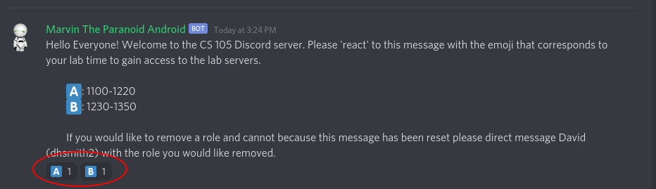

# About the Course
{:.no_toc}

## Table of contents
{: .no_toc .text-delta }

1. TOC
{:toc}

---

## Course Description
This course is intended to be a gentle introduction to the world of 
computer science. You will be covering:
1. A general overview of how computer evolved to be what they are today.
2. The fundamentals of programming in the Python language.
3. The fundamental of storing and manipulating data in Excel.
4. How the internet works and how to make a basic website.

## Tools and Resources

## Course Elements

### zyBooks and Post-Reading

The zyBook activities include reading section of the textbook and completing the interactive activities along the way. In zyBooks there are two types of problems: challenge and participation.  <b>For this course you only required to complete the participation activities to receive credit. However, it is still strongly recommended that you attempt the challenge problems as they are good preparation for the quizzes and homework.</b> 

Post-readings activities are on PrairieLearn and are our attempt to solicit information on what aspect of the readings were confusing and which topics were of interest to you. Please respond to these questions thoughtfully and with as much detail as possible as they help us construct the lectures. All due dates for zyBooks and post-reading activities are listed on the course [calendar](https://hamiltonfour.tech/cs-105-summer-21/calendar/) and are due at <b><u>11:00 PM CST</u></b> for each respective due date listed.

#### Adding the Course in zyBooks

1. Sign in or create an account at learn.zybooks.com
2. Enter zyBook code: ILLINOISCS105Summer2021
3. Subscribe 

### Homework

There is a single homework assigned every week that is due Friday on <b><u>11:00 PM CST</u></b>. Homework activities can be found on the courses's PrairieLearn. Late work is accepted for partial credit (70%) up to a week after the initial due date.

 
### Lecture

Lectures will meet on Zoom twice a week and be accompanied by Discord text chat rooms where you can collaborate with your peers for the included lecture questions. The structure of the lectures will be as follows: announcements/reminders, lecture questions muddiest points and general points from the topic due the previous Sunday, mini-lecture on upcoming topic. The interactive elements of the lecture will consist of questions related to topics that have been recently covered in the course, Zoom polls on the question, followed by a discussion of the correct answer. For each question there will be two polls. The first is intended to be completed individually and the second is intended to be completed with the help of your Discord chat room. Additionally, the first poll is graded for participation and the second is graded for correctness. In aggregate these points will be used to calculate your lecture participation grade.

The following is the link to the lecture: [https://illinois.zoom.us/j/88475720498?pwd=aFN3cHVCTlZVWnU2N2IxR2xLUUZzZz09]( https://illinois.zoom.us/j/88475720498?pwd=aFN3cHVCTlZVWnU2N2IxR2xLUUZzZz09 )

### Labs

Labs will meet using Discord and be focused on giving students practice with the course content and debugging code.  They are designed to be completed by a group of students rather than individually so you are encouraged to work with your peers. Though both attendance and completion will contribute to your grade lab completion is largely based on effort put in and ability to demonstrate to a course TA or CA the work that has been done on the lab rather than a set "correctness" standard.

Follow these steps to get Discord setup and running on your computers:
1. Make an account with your Illinois outlook account: [discord.com](https://discord.com)
2. Download the desktop applications from the website and login: [discord.com/download](https://discord.com/download)
3. Join the lab server via the following invite link that was wsent via email last week or the link on the course announcments page. The link will also be given out during the first lecture when we are going over lab sections.

When you are in the channel, you will see a message from the Discord bot (Marvin) asking you to "react" to its message with the letter icon. Simply click on the emoji below the corresponds to your lab section.

Once you have done this, the Marvin will automatically add a role to your user profile giving you access to your section's lab channel. This should appear on the left-hand side under the category "Lab Channels" as pictured below.

You can always come back to Marvin’s message and select a different lab section by:
1. Clicking your previous lab section’s associated emoji to remove your reaction.
2. Clicking on the icon associated with the lab section you wish to attend.
This will remove access to your previous lab section and give you access to the new one you desire to attend. 

## Quizzes and the Final Exam

All quizzes and the final exam will be given on the [PrairieLearn](https://www.prairielearn.org/) online assessment platform and proctored by the CBTF. More information on this can be found in the .

## Grading

### Activity Weights

| Activity                             | Grade Percentage                   |
| ------------------------------------ | ---------------------------------- |
| Textbook Exercises                   | 5%                                 |
| Post-reading Activities & Homework   | 25%                                |
| Labs                                 | 15%                                |
| Quizzes                              | 27% total (1x2% and 5x5%)          |
| Final Exam                           | 25%                                |
| Lecture Polls                        | 3%                                 |

### Percent to Letter Grades

|  Score Percentage  |  Grade  |
| ------------------ | ------- |
|  97 and above      |  A+     |
|  93 - 96.99        |  A      |
|  90 - 92.99        |  A-     |
|  87 - 89.99        |  B+     |
|  83 - 86.99        |  B      |
|  80 - 82.99        |  B-     |
|  77 - 79.99        |  C+     |
|  73 - 76.99        |  C      |
|  70 - 72.99        |  C-     |
|  67 - 69.99        |  D+     |
|  63 - 66.99        |  D      |
|  60 - 62.99        |  D-     |
|  59.99 and below   |  F      |

